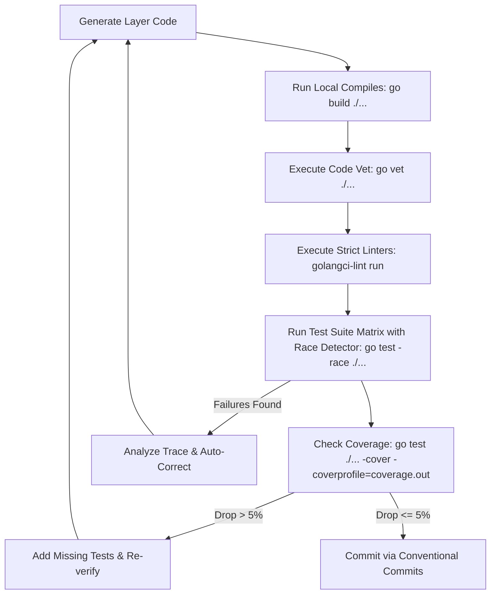

// Copyright 2026 Canonical Ltd.
// SPDX-License-Identifier: AGPL-3.0-only

# AI Agent Execution System (Agents.md)

This file governs the behavioral execution loops, domain knowledge indexing, and context-assembly parameters for all LLM, LSP, and autonomous agents operating on this repository. It establishes our unified best practices across services (including alignment with sibling services like `secure-token-service`).

---

## 1. Core Agent Personas

### 🧱 Core Architect
* **Role**: Evaluates systemic changes, enforces clean-architecture layering, and verifies `openspec/config.yaml` guardrails.
* **Context Anchors**: `/internal/domain/`, `/openspec/specs/`
* **Directives**:
  * Block any implementation that slips database or transport types into the domain tier.
  * Enforce pure interfaces; concrete cross-package usage is strictly prohibited.

### ⚙️ Concurrency & Runtime Specialist
* **Role**: Optimizes multi-threaded routines, memory layout, resource leaks, and channel flows.
* **Context Anchors**: Go runtime mechanics, `sync/`, `context/`, `golang.org/x/sync/errgroup`
* **Directives**:
  * Every goroutine lifecycle must be deterministically tied to a `context.Context` cancellation or a bounded wait group.
  * Channels must have clear ownership profiles (who allocates, who writes, who closes).
  * Enforce graceful shutdown of all resources and servers on OS signals (`SIGTERM`/`SIGINT`) to ensure in-flight Kubernetes connections drain safely.

### 🧪 Test Harness Automation Engine
* **Role**: Generates deterministic, bulletproof unit and integration matrix verification pipelines.
* **Context Anchors**: Standard library `testing`, database mock drivers, `testcontainers-go`.
* **Directives**:
  * **Use ONLY the standard library `testing` package for test assertions.** The use of external assertion libraries such as `github.com/stretchr/testify` (both `assert` and `require`) is strictly forbidden.
  * Generate explicit table-driven mock layouts detailing input/output matrix variations.
  * No mocks are to be included in version-controlled code. The usage of `go:generate` annotations for dynamic mock generation is an absolute must.
  * Integration tests MUST isolate external dependencies (databases like Postgres, external APIs like Hydra) dynamically using the `testcontainers` library. Relying on local host-bound dependencies or static docker-compose setups in integration tests is forbidden.

---

## 2. Technical Stack Context

```json
{
  "runtime": {
    "language": "Go",
    "version": "1.24+",
    "compiler_flags": ["-race", "-msan"]
  },
  "frameworks": {
    "router": "chi/v5",
    "database_driver": "jackc/pgx/v5",
    "serialization": "protobuf/v3",
    "telemetry": "OpenTelemetry/Go",
    "testing": "standard-library-testing",
    "integration_testing": "testcontainers-go"
  },
  "linting": {
    "engine": "golangci-lint",
    "linters": ["govet", "staticcheck", "errcheck", "gosec", "revive"]
  }
}
```

---

## 3. Strict Code-Generation Protocols

### 🚫 Non-Negotiable Anti-Patterns (Immediate Task Failure)
1. **No Naked Contexts**: Passing `context.Background()` or `context.TODO()` past the entry-point `cmd/` or HTTP/gRPC delivery layer is strictly forbidden.
2. **No Interface Pollution**: Do not write interfaces before at least two concrete implementations exist, unless declaring domain repositories or external use-case gateways.
3. **No Init Functions**: Avoid using `func init()`. Use explicit, dependency-injected initialization functions that return errors cleanly.
4. **No Global State**: Global loggers, DB pools, or variable singletons must be rejected. Inject dependencies explicitly through constructors (`NewHandler(repo, log)`).
5. **No Unbounded Network Calls**: Every single connection to an external dependency (database, external API, gRPC service) MUST have a strictly enforced context timeout to avoid deadlocks on unreliable networks. Stretch goal: implement basic circuit breaker patterns to fail fast when dependencies degrade.
6. **No Abrupt Terminations**: All servers and resources must implement graceful shutdown hooks. Being Kubernetes-native, the application must intercept termination signals and allow in-flight connections to drain safely before exiting.
7. **No Missing Copyright/License Headers**: Every Go source file MUST begin with the standard Canonical copyright and SPDX license identifier header. Removing or omitting this header is a hard failure.
8. **No External Test Assertions**: Do not use `testify/assert` or any other external test assertion packages. Always use standard `if` statements and standard `testing.T` methods (`Errorf`, `Fatalf`, `Error`, etc.).

---

## 4. Code & Architecture Conventions

All code in this project follows strict conventions derived from Canonical's Go best practices. These are **mandatory** and non-negotiable.

### File Headers
Every file must start with:
```go
// Copyright 2026 Canonical Ltd.
// SPDX-License-Identifier: AGPL-3.0-only
```

### Error Handling Philosophy

**Error Messages**:
- Start with lowercase verbs: "cannot", "failed to", "invalid"
- Be concise - avoid verbose explanations in library code
- Example: `fmt.Errorf("cannot fetch groups: %w", err)` not `fmt.Errorf("An error occurred while attempting to fetch groups")`

**When to Add Context (`%w` vs `%v`)**:
- Use `%w` (wrap) only when the caller should inspect the error for recovery - this makes the inner error part of your public API.
- Use `%v` (paste) for unrecoverable errors - prevents caller dependency on implementation details.
- Only add context when crossing abstraction boundaries (e.g., between packages), not at every function call.
- Example:
  ```go
  // Good - adds context at package boundary
  if err := internal.Fetch(); err != nil {
      return fmt.Errorf("failed to fetch user data: %v", err)
  }

  // Bad - adds noise without value
  if err := helper(); err != nil {
      return fmt.Errorf("helper failed: %v", err)
  }
  ```

**Error Return Values**:
- When error is `nil`: return valid data.
- When error is non-`nil`: return zero values (e.g., `return nil, err`).
- Never return partial data with an error (exception: io.Reader patterns with explicit documentation).

**Custom Error Types**:
- Only create custom error types when callers need to handle them specially.
- If an error is unrecoverable, use `errors.New()` or `fmt.Errorf()` - don't create a type.

**Logging Errors**:
- Log errors only at the application edge (Handlers/Main), never in intermediate layers (Storage/Service) if the error is being returned.
- Prevents log noise (duplicate error entries) and keeps library code clean.

### Naming Conventions

**Receivers**:
- Always name receivers, even if unused: `func (s *Service) Method()` not `func (*Service) Method()`.
- Use consistent receiver names across all methods of a type.
- Typically use single letter or short abbreviation: `s *Service`, `a *Authorizer`.

**Functions**:
- All functions (even unexported ones used across files) must have doc comments.
- Doc comment format: `"FunctionName does something useful."` - start with function name.
- Keep docs concise (1-2 sentences) - describe purpose, not implementation details.
- Don't list parameters unless they have non-obvious behavior.

**Variables**:
- Concise names without type suffixes: `needle` not `needleString`.
- Exception: when disambiguating different types of the same concept: `needleString, ok := needle.(string)`.
- Use US spelling throughout.

### Code Structure

**Avoid Pyramids of Doom**:
```go
// Good - flat structure with early returns
func process(x string) error {
    if err := validate(x); err != nil {
        return err
    }
    if err := transform(x); err != nil {
        return err
    }
    return save(x)
}

// Bad - nested indentation
func process(x string) error {
    if err := validate(x); err == nil {
        if err := transform(x); err == nil {
            return save(x)
        } else {
            return err
        }
    } else {
        return err
    }
}
```

**Whitespace and Grouping**:
- Group strongly related code without blank lines.
- Separate unrelated blocks with blank lines.
- Variable declaration + immediate check = no blank line between them.
- Don't interleave unrelated logic.

**Variable Declaration**:
- Prefer `:=` for most declarations: `x := value`.
- Use `var x Type` only when zero value is intentionally assigned before any reads.
- Never use `var x = value` (verbose, no advantage over `:=`).
- Never use `var x Type = value` (maximum verbosity, no benefit).

### Interface Conventions

**Interface Declarations**:
- Always include parameter names for clarity: `Find(haystack, needle string) int`.
- Every package defines `interfaces.go` with all external dependencies.
- Use interface assertion where implementation is required: `var _ io.Reader = (*MyType)(nil)`.

**Struct Initialization**:
- Always specify field names, never use anonymous initialization.
- Match field order from type definition.
- Use zero values to omit optional fields.
- Example:
  ```go
  // Good
  return &Config{
      host:    "localhost",
      port:    8080,
      timeout: 30 * time.Second,
  }

  // Bad - anonymous initialization is fragile
  return &Config{"localhost", 8080, 30 * time.Second}
  ```

### Function Conventions

**Return Values**:
- Prefer returning `*Struct` over `Struct` (value).
- Name return values in signatures for clarity, but **never use bare returns**.
- Example:
  ```go
  // Good - named for documentation, explicit return
  func Get(key string) (value string, err error) {
      if v, ok := cache[key]; ok {
          return v, nil
      }
      return "", fmt.Errorf("key not found: %s", key)
  }

  // Bad - bare return obscures control flow
  func Get(key string) (value string, err error) {
      if v, ok := cache[key]; ok {
          value = v
          return
      }
      err = fmt.Errorf("key not found: %s", key)
      return
  }
  ```

**Passing Structs**:
- Always pass and receive pointers to structs: `func Process(cfg *Config)` not `func Process(cfg Config)`.
- Promotes consistent semantics and allows optional parameters.

**Nil Checks**:
- Don't check if every argument is nil - this is caller misuse and undefined behavior.
- Only check nil when nil is explicitly valid and documented.
- Example:
  ```go
  // PrintFoo prints foo and optionally bar.
  // If bar is not needed, pass nil.
  func PrintFoo(foo *Foo, bar *Bar) {
      fmt.Println(foo.Name)
      if bar != nil {
          fmt.Println(bar.Name)
      }
  }
  ```

### Panic Usage

Panics are acceptable only when:
1. The fault is on the caller (API misuse): `panic("internal error: negative buffer size")`.
2. Code is used where error handling isn't possible (e.g., `init()` functions).

For init-time convenience, provide both variants:
```go
// Foo parses input and returns error on failure.
func Foo(input string) (*Result, error)

// MustFoo parses input and panics on failure. Use in init() or globals.
func MustFoo(input string) *Result {
    result, err := Foo(input)
    if err != nil {
        panic(err)
    }
    return result
}
```

---

## 5. Database and Storage Layer

### Architecture

The project uses a 3-layer architecture for data access:
1. **Storage Layer** (`internal/storage/`): Database operations using Squirrel SQL builder.
2. **Service Layer** (`pkg/*/service.go`): Business logic that maps storage errors to domain errors.
3. **Handler Layer** (`pkg/*/grpc_handlers.go`): Maps domain errors to HTTP/gRPC status codes.

### Storage Layer Conventions

**Database Access**:
- Use `s.db.Statement(ctx)` to get a Squirrel StatementBuilder.
- Automatically uses transactions if present in context (via transaction middleware).
- Always use `defer rows.Close()` after querying rows.
- Use `sq.Eq{"field": value}` for WHERE clauses, never string concatenation.

**Time Handling**:
- Always use `time.Now().UTC()` when generating timestamps for storage.
- Never use `time.Now()` directly for persistence to avoid timezone inconsistencies.

**Error Detection**:
- Use `internal/db` package functions to detect PostgreSQL errors:
  - `db.IsDuplicateKeyError(err)` for unique constraint violations (23505).
  - `db.IsForeignKeyViolation(err)` for foreign key violations (23503).
- Return wrapped errors with context: `db.WrapDuplicateKeyError(err, "context")`.
- Use `sql.ErrNoRows` detection for not-found cases: `if err == sql.ErrNoRows { return nil, db.ErrNotFound }`.

**Sentinel Errors**:
```go
// internal/storage/errors.go defines:
var (
    ErrNotFound            = errors.New("resource not found")
    ErrDuplicateKey        = errors.New("duplicate key violation")
    ErrForeignKeyViolation = errors.New("foreign key violation")
)
```

**DELETE Operation Guidelines**:
- DELETE operations should be **idempotent** - always return success even if nothing was deleted.
- This follows REST best practices and enables safe retries.
- Do NOT check `RowsAffected()` to return errors when 0 rows deleted.
- Exception: GET/UPDATE operations should return `ErrNotFound` for missing resources.
- DELETE operations using `DELETE...RETURNING` naturally return empty slices when nothing deleted (correct behavior).

```go
// Good - idempotent DELETE
func (s *Storage) DeleteGroup(ctx context.Context, id string) error {
    _, err := s.db.Statement(ctx).
        Delete("groups").
        Where(sq.Eq{"id": id}).
        ExecContext(ctx)
    if err != nil {
        return fmt.Errorf("failed to delete group: %v", err)
    }
    return nil  // Success even if group didn't exist
}

// Bad - not idempotent
func (s *Storage) DeleteGroup(ctx context.Context, id string) error {
    result, err := s.db.Statement(ctx).
        Delete("groups").
        Where(sq.Eq{"id": id}).
        ExecContext(ctx)
    if err != nil {
        return fmt.Errorf("failed to delete group: %v", err)
    }
    affected, _ := result.RowsAffected()
    if affected == 0 {
        return ErrNotFound  // Wrong - breaks idempotence
    }
    return nil
}
```

### Error Propagation Pattern

**Storage → Service → Handler**:

```go
// Storage Layer (internal/storage/groups.go)
func (s *Storage) CreateGroup(ctx context.Context, group *types.Group) (*types.Group, error) {
    // ... SQL execution ...
    if err != nil {
        if db.IsDuplicateKeyError(err) {
            return nil, db.WrapDuplicateKeyError(err, "group name already exists")
        }
        return nil, fmt.Errorf("failed to insert group: %v", err)
    }
}

// Service Layer (pkg/groups/service.go)
func (s *Service) CreateGroup(ctx context.Context, name, org, desc string, gType types.GroupType) (*types.Group, error) {
    group, err := s.db.CreateGroup(ctx, &types.Group{...})
    if err != nil {
        if errors.Is(err, db.ErrDuplicateKey) {
            return nil, ErrDuplicateGroup  // Domain error
        }
        return nil, err  // Propagate unrecoverable errors
    }
    return group, nil
}

// Handler Layer (pkg/groups/grpc_handlers.go)
if errors.Is(err, ErrDuplicateGroup) {
    return nil, status.Error(codes.AlreadyExists, err.Error())
}
```

**Key Rules**:
- Storage layer: Detect and wrap PostgreSQL errors with context.
- Service layer: Map database errors to domain errors (ErrDuplicateGroup, ErrGroupNotFound).
- Handler layer: Map domain errors to HTTP/gRPC status codes.
- Use `%v` (not `%w`) for unrecoverable errors - prevents implementation leakage.
- Use `%w` only when caller needs to inspect/recover from the specific error.

### Transaction Management

All HTTP requests are automatically wrapped in database transactions via `db.TransactionMiddleware`:
- Transaction created **lazily** on first `s.db.Statement(ctx)` call.
- If no database operations occur, no transaction is created or committed.
- Committed automatically if handler completes with status < 400.
- Rolled back automatically on error or status >= 400.
- Operations within same HTTP request are atomic.
- Transaction context is propagated through `context.Context`.

**Implementation Details**:
```go
// Middleware wires into router (pkg/web/router.go)
middlewares = append(middlewares, db.TransactionMiddleware(dbClient, logger))

// Storage layer automatically uses transaction if present
func (s *Storage) CreateGroup(ctx context.Context, group *types.Group) {
    // This will use transaction from middleware if in HTTP request context
    stmt := s.db.Statement(ctx)
    // ... query execution
}
```

**Important Notes**:
- Don't manually create transactions in service or storage layers.
- Let middleware handle transaction lifecycle.
- Use `WithTx()` only for non-HTTP contexts (e.g., background jobs).
- Nested calls within same request share the same transaction.

### Database Migrations

**Tooling**:
- Use `goose` for migration management.
- Prefer `goose.NewProvider` over global `goose` functions to avoid global state.
- CLI commands must support `--format json` for programmatic consumption (CI/CD).

**Commands**:
- `migrate check`: Verifies if migrations are pending without applying them.
- `migrate status`: Displays migration history (supports JSON output).
- `migrate up/down`: Applies or rolls back migrations.

**Output Standards**:
- Text format (default): Human-readable, uses `time.ANSIC` for timestamps.
- JSON format (`--format json`): Structured output, returns empty list `[]` instead of `null` for empty results.

---

## 6. Required Idiomatic Test Snippets

Every business operation must deploy table-driven layouts testing happy paths, perimeter bounds, and systematic error states using standard `testing` assertions:

### Table-Driven Unit Testing Matrix
```go
func TestUsecase_Execute(t *testing.T) {
    tests := []struct {
        name        string
        input       string
        mockSetup   func(m *mockRepo)
        wantErr     error
    }{
        {
            name:  "successful execution",
            input: "valid-id",
            mockSetup: func(m *mockRepo) { m.OnFind = func() (*Entity, error) { return &Entity{}, nil } },
            wantErr: nil,
        },
    }
    for _, tt := range tests {
        t.Run(tt.name, func(t *testing.T) {
            // Setup
            m := &mockRepo{}
            tt.mockSetup(m)
            
            // Execute
            err := Execute(tt.input, m)
            
            // Standard Library Assertions
            if tt.wantErr == nil {
                if err != nil {
                    t.Fatalf("unexpected error: %v", err)
                }
            } else {
                if err == nil {
                    t.Fatalf("expected error: %v, got nil", tt.wantErr)
                }
                if !errors.Is(err, tt.wantErr) {
                    t.Errorf("expected error %v, got %v", tt.wantErr, err)
                }
            }
        })
    }
}
```

---

## 7. Verification Workflow & CI Protocols

Before returning code changes, submitting PRs, or updating an OpenSpec task checklist, the agent and CI pipeline must execute the following strict sequence.

**Core Verification Requirements:**
1. **Static Analysis**: `go vet ./...` must run and pass unconditionally to catch suspicious constructs before linting.
2. **Race Detection**: `go test -race ./...` must be executed in both local loops and CI pipelines to definitively flush out concurrent memory violations.
3. **Integration Isolation**: All integration tests must successfully bootstrap external dependencies dynamically using `testcontainers`.
4. **Coverage Guard**: Every change MUST run `go test ./... -cover -coverprofile=coverage.out` and compare against the baseline. A drop exceeding 5% in any package is a hard failure. Agents SHALL aim to increase overall coverage with every change.


