# Architecture Design: Parallel Standalone & Canonical Portal Support in Hook Service

**Date:** 2026-09-24  
**Service:** `hook-service`  
**Purpose:** Architecture design and implementation specification for supporting both Standalone (Identity Platform) and Canonical Portal authorization variants parallelly in `hook-service` without runtime `if-else` branching.

---

## 1. Context & Use Cases

`hook-service` supports two distinct authorization use cases across Canonical's ecosystem:

1. **Standalone Variant (Canonical Identity Platform)**:
   - **Current Authorization**: Pure RBAC. Upstream Istio `ext_authz` protects admin routes by checking global role membership (`user -> assignee -> role:admin`) via `authorization-service`.
   - **Event Publishing**: Zero Kafka events published.
   - **Future Evolution**: Standalone may evolve its authorization model in the future (e.g., fine-grained ReBAC or per-group claims), which would require emitting permission events to Kafka topic `hook-service.permissions`.

2. **Portal Variant (Canonical Portal)**:
   - **Current Authorization**: Fine-grained ReBAC on groups (`portal-group:<id>`). Users create groups, become group owners, and delegate member management.
   - **Event Publishing**: Actively publishes ReBAC operations (owner/member updates) to Kafka topic `portal.permissions`.
   - **Deployment**: Deployed as an independent workload with its own dedicated PostgreSQL database.

---

## 2. Decision Matrix

| Dimension | Standalone Variant (Identity Platform) | Portal Variant (Canonical Portal) |
|---|---|---|
| **Build Tag** | `//go:build standalone` | `//go:build portal` |
| **Service Slug** | `hook-service` | `portal` |
| **Kafka Topic** | `hook-service.permissions` | `portal.permissions` |
| **OpenFGA Object Type** | `group-in-claim` | `portal-group` |
| **Current Authorization** | RBAC (`role:admin`) | ReBAC (`portal-group:<id>`) |
| **Current Event Emission** | 0 Kafka events | Active ReBAC events to Kafka |
| **Future Model Evolution** | Can evolve to emit `group-in-claim` events | Can evolve with custom portal roles |
| **Database** | Dedicated PostgreSQL database | Dedicated PostgreSQL database |
| **API Surface** | Shared gRPC/HTTP contracts (`v0/authz_groups`) | Shared gRPC/HTTP contracts (`v0/authz_groups`) |
| **Server Lifecycle** | Shared [`cmd.serve`](file:///home/shu.du@canonical.com/workspaces/canonical/sync/hook-service/cmd/serve.go) lifecycle | Shared [`cmd.serve`](file:///home/shu.du@canonical.com/workspaces/canonical/sync/hook-service/cmd/serve.go) lifecycle |

---

## 3. Explicit Build Tag Strategy

Instead of using negated tags like `!portal` (which defines Standalone merely as the absence of Portal and becomes fragile if additional flavors are introduced), we use **explicit, positive build tags**:

* **Standalone build**: `//go:build standalone`
* **Portal build**: `//go:build portal`

Both variants are treated as first-class targets. In the `Makefile`:

```makefile
# Default build targets standalone explicitly
build:
	$(GO) build $(GOFLAGS) -tags standalone -o $(GO_BIN) ./
.PHONY: build

# Portal build target
build-portal:
	$(GO) build $(GOFLAGS) -tags portal -o $(GO_BIN)-portal ./
.PHONY: build-portal

# Test suite covering both variants
test: mocks vet
	$(GO) test -tags standalone ./... -cover -coverprofile coverage_source.out
	$(GO) test -tags portal ./...
.PHONY: test
```

---

## 4. Architecture: Model-Driven Authorization Adapter

To prevent runtime `if-else` branching, authorization side-effects are decoupled from core domain logic via a compile-time adapter interface.

```mermaid
flowchart TD
    subgraph Domain Tier [Core Domain Tier - Zero Authz Knowledge]
        Service["groups.Service (pkg/groups)"]
        DB[("PostgreSQL Storage")]
        Service -->|CRUD| DB
    end

    subgraph Adapter Tier [Authz Model Adapters - Zero if-else]
        Interface["GroupAuthzAdapter (Interface)"]
        Service -->|Lifecycle Hook| Interface
        
        StandaloneAdapter["StandaloneAuthzAdapter (//go:build standalone)<br/>• Model: group-in-claim / role:admin<br/>• Slug: hook-service<br/>• Topic: hook-service.permissions<br/>• Current: 0 events<br/>• Future: group-in-claim tuples"]
        PortalAdapter["PortalAuthzAdapter (//go:build portal)<br/>• Model: portal-group<br/>• Slug: portal<br/>• Topic: portal.permissions<br/>• Current: ReBAC owner/member tuples"]
        
        Interface -.->|Compiled via -tags standalone| StandaloneAdapter
        Interface -.->|Compiled via -tags portal| PortalAdapter
    end

    subgraph Infrastructure Tier [Shared Kafka Pipeline]
        Publisher["kafka.PermissionPublisher"]
        Kafka["Kafka Broker"]
        StandaloneAdapter -->|PublishOperations| Publisher
        PortalAdapter -->|PublishOperations| Publisher
        Publisher --> Kafka
    end
```



---

## 5. Implementation Blueprint

### 5.1 Domain Lifecycle Interface (`pkg/groups/interfaces.go`)

`groups.Service` notifies an adapter of domain events without knowing anything about OpenFGA models, relations, or Kafka topics:

```go
// GroupAuthzAdapter handles authorization side-effects during group lifecycle events.
type GroupAuthzAdapter interface {
    OnGroupCreated(ctx context.Context, group *types.Group, creatorID string) error
    OnGroupDeleted(ctx context.Context, groupID string) error
    OnUsersAdded(ctx context.Context, groupID string, userIDs []string) error
    OnUsersRemoved(ctx context.Context, groupID string, userIDs []string) error
}
```

### 5.2 Clean Service Logic without `if-else` (`pkg/groups/service.go`)

```go
func (s *Service) CreateGroup(ctx context.Context, group *types.Group) (*types.Group, error) {
    ctx, span := s.tracer.Start(ctx, "groups.Service.CreateGroup")
    defer span.End()

    if group.ID != "" {
        return nil, ErrInvalidGroupID
    }

    createdGroup, err := s.db.CreateGroup(ctx, group)
    if err != nil {
        if errors.Is(err, storage.ErrDuplicateKey) {
            return nil, ErrDuplicateGroup
        }
        return nil, err
    }

    // Delegate model-specific side-effects (Zero if-else)
    creatorID := authentication.UserIDFromContext(ctx)
    if err := s.authzAdapter.OnGroupCreated(ctx, createdGroup, creatorID); err != nil {
        s.logger.Warnf("failed to process group authz lifecycle: %v", err)
    }

    return createdGroup, nil
}
```

### 5.3 Standalone Model Adapter (`internal/policy/authz_standalone.go`)

```go
//go:build standalone

// Copyright 2026 Canonical Ltd.
// SPDX-License-Identifier: AGPL-3.0-only

package policy

import (
    "context"
    "github.com/canonical/hook-service/internal/types"
)

type standaloneAuthzAdapter struct {
    db        DatabaseInterface
    publisher PermissionPublisherInterface
}

func NewAuthzAdapter(db DatabaseInterface, pub PermissionPublisherInterface) GroupAuthzAdapter {
    return &standaloneAuthzAdapter{db: db, publisher: pub}
}

func (a *standaloneAuthzAdapter) OnGroupCreated(ctx context.Context, group *types.Group, creatorID string) error {
    // Current Model: Pure RBAC (role:admin). Zero Kafka events needed.
    // Future Evolution: If Standalone adopts ReBAC, emit group-in-claim tuples here.
    return nil
}

func (a *standaloneAuthzAdapter) OnGroupDeleted(ctx context.Context, groupID string) error {
    return nil
}

func (a *standaloneAuthzAdapter) OnUsersAdded(ctx context.Context, groupID string, userIDs []string) error {
    return nil
}

func (a *standaloneAuthzAdapter) OnUsersRemoved(ctx context.Context, groupID string, userIDs []string) error {
    return nil
}
```

### 5.4 Portal Model Adapter (`internal/policy/authz_portal.go`)

```go
//go:build portal

// Copyright 2026 Canonical Ltd.
// SPDX-License-Identifier: AGPL-3.0-only

package policy

import (
    "context"
    "fmt"
    v1 "github.com/canonical/hook-service/gen/authorization/service/api/v1"
    "github.com/canonical/hook-service/internal/types"
)

type portalAuthzAdapter struct {
    db        DatabaseInterface
    publisher PermissionPublisherInterface
}

func NewAuthzAdapter(db DatabaseInterface, pub PermissionPublisherInterface) GroupAuthzAdapter {
    return &portalAuthzAdapter{db: db, publisher: pub}
}

func (a *portalAuthzAdapter) OnGroupCreated(ctx context.Context, group *types.Group, creatorID string) error {
    if creatorID == "" {
        return nil
    }

    if err := a.db.AddGroupOwner(ctx, group.ID, creatorID); err != nil {
        return fmt.Errorf("failed to record portal group owner: %w", err)
    }

    subject := fmt.Sprintf("user:%s", creatorID)
    object := fmt.Sprintf("portal-group:%s", group.ID)
    return a.publisher.PublishWrite(ctx, subject, "owner", object)
}

func (a *portalAuthzAdapter) OnGroupDeleted(ctx context.Context, groupID string) error {
    members, _ := a.db.ListUsersInGroup(ctx, groupID)
    owners, _ := a.db.ListOwnersInGroup(ctx, groupID)

    object := fmt.Sprintf("portal-group:%s", groupID)
    ops := make([]Operation, 0, len(members)+len(owners))
    for _, member := range members {
        ops = append(ops, Operation{
            Op:       v1.PermissionOp_PERMISSION_OP_DELETE,
            Subject:  fmt.Sprintf("user:%s", member),
            Relation: "member",
            Object:   object,
        })
    }
    for _, owner := range owners {
        ops = append(ops, Operation{
            Op:       v1.PermissionOp_PERMISSION_OP_DELETE,
            Subject:  fmt.Sprintf("user:%s", owner),
            Relation: "owner",
            Object:   object,
        })
    }
    return a.publisher.PublishOperations(ctx, ops...)
}

func (a *portalAuthzAdapter) OnUsersAdded(ctx context.Context, groupID string, userIDs []string) error {
    object := fmt.Sprintf("portal-group:%s", groupID)
    ops := make([]Operation, len(userIDs))
    for i, uID := range userIDs {
        ops[i] = Operation{
            Op:       v1.PermissionOp_PERMISSION_OP_WRITE,
            Subject:  fmt.Sprintf("user:%s", uID),
            Relation: "member",
            Object:   object,
        }
    }
    return a.publisher.PublishOperations(ctx, ops...)
}

func (a *portalAuthzAdapter) OnUsersRemoved(ctx context.Context, groupID string, userIDs []string) error {
    object := fmt.Sprintf("portal-group:%s", groupID)
    ops := make([]Operation, len(userIDs))
    for i, uID := range userIDs {
        ops[i] = Operation{
            Op:       v1.PermissionOp_PERMISSION_OP_DELETE,
            Subject:  fmt.Sprintf("user:%s", uID),
            Relation: "member",
            Object:   object,
        }
    }
    return a.publisher.PublishOperations(ctx, ops...)
}
```

---

## 6. Summary of Architectural Benefits

1. **Clear, Explicit Naming**: Uses positive tags `standalone` and `portal`. No confusing negated tags (`!portal`).
2. **Accurate Authorization State**: Accurately recognizes Standalone's current use of pure RBAC (`role:admin`) with zero Kafka events, while preserving its ability to evolve.
3. **Zero `if-else` in Domain Logic**: `groups.Service` is 100% free of authorization model logic or flavor branching.
4. **Independent Evolution**: Changes to Portal's ReBAC model or Standalone's model remain completely isolated in their respective adapters.
