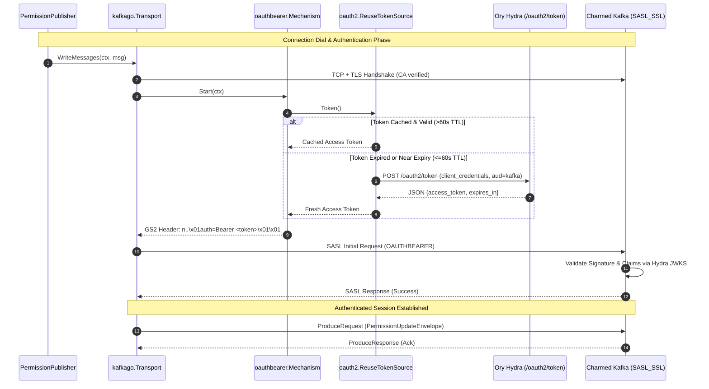

## Context

In platform deployment mode, `hook-service` acts as an event producer publishing permission synchronization envelopes (`PermissionUpdateEnvelope`) to Kafka via `internal/kafka/producer.go`. The current implementation initializes a `segmentio/kafka-go` writer using plain TCP:
```go
Addr: kafkago.TCP(brokers...)
```
In production deployments managed by Charmed Operators alongside the Canonical Identity Platform (Ory Hydra and Ory Kratos), Kafka brokers are secured using `SASL_SSL` listeners that enforce SASL/OAUTHBEARER authentication and TLS encryption. Tokens are issued by Ory Hydra via OAuth2 Client Credentials grant (`grant_type=client_credentials`), containing an audience claim `aud: ["kafka"]` and validated by Kafka against Hydra's JWKS endpoint.

Because `segmentio/kafka-go` lacks built-in SASL/OAUTHBEARER support, `hook-service` cannot currently authenticate to secure Kafka clusters. This design establishes how `hook-service` implements client-side SASL/OAUTHBEARER, in-memory token lifecycle management, and TLS transport configuration while preserving existing interfaces.

## Goals / Non-Goals

**Goals:**
- Implement a custom, RFC 7628-compliant `sasl.Mechanism` for `segmentio/kafka-go`.
- Provide thread-safe in-memory token caching and proactive renewal via `golang.org/x/oauth2/clientcredentials`.
- Support TLS configuration (`SASL_SSL`) with custom CA certificate loading.
- Enable connection recycling on `kafkago.Transport` to handle token rotation seamlessly across long-lived producer lifecycles.
- Extend `internal/config/specs.go` with validation for SASL and TLS parameters, defaulting to `none` for backward compatibility.
- Emit OpenTelemetry spans and Prometheus metrics for token acquisition and connection health.

**Non-Goals:**
- Migrating the codebase from `segmentio/kafka-go` to `twmb/franz-go` or Sarama.
- Managing OAuth2 client creation or JWKS configuration in Ory Hydra.
- Configuring Kafka broker ACLs or topic partitioning.
- Implementing in-band KIP-368 SASL re-authentication without TCP connection recycling.

## System Architecture



## Decisions

### Decision 1: Implement Custom SASL Mechanism on `segmentio/kafka-go` vs. Migrating to `franz-go`
- **Choice**: Implement `sasl.Mechanism` and `sasl.StateMachine` in `internal/kafka/sasl/` for `segmentio/kafka-go`.
- **Rationale**: `segmentio/kafka-go` exposes a minimal, pluggable 2-method SASL interface (`Name() string`, `Start(ctx) (StateMachine, []byte, error)`). The RFC 7628 wire framing is under 50 lines of pure Go. Implementing this mechanism requires zero changes to `PermissionPublisher`, writer mock generation, or test helpers.
- **Alternatives Considered**:
  - *Migrate to `twmb/franz-go`*: Provides native KIP-368 re-authentication and modern APIs, but would require rewriting `internal/kafka/producer.go`, updating all interfaces, rewriting unit/integration tests, and replacing mock generators. Rejected as disproportionate for adding SASL authentication to an existing writer.
  - *Migrate to `IBM/sarama`*: Heavy dependency with complex configuration and historical maintenance churn. Rejected.

### Decision 2: In-Memory Token Lifecycle with `oauth2.ReuseTokenSource` & Proactive Renewal
- **Choice**: Use Go's standard `golang.org/x/oauth2/clientcredentials` wrapped in an early renewal buffer (`EarlyRenewalTokenSource`).
- **Rationale**: `clientcredentials.Config.TokenSource(ctx)` internally uses `oauth2.ReuseTokenSource`, which provides thread-safe in-memory caching and single-flight execution (preventing concurrent thundering herds to Hydra). We wrap this with an early refresh threshold ($60\text{s}$ buffer) to ensure any token used during a connection dial has adequate remaining validity.
- **Alternatives Considered**:
  - *Custom token cache with `sync.RWMutex`*: Redundant; `golang.org/x/oauth2` already provides a vetted, race-free implementation.
  - *Fetch token on every Kafka dial without caching*: Causes unnecessary latency and hammers Hydra's token endpoint during broker reconnects.

### Decision 3: Connection Recycling for Token Renewal
- **Choice**: Configure `IdleTimeout: 5 * time.Minute` on `kafkago.Transport`.
- **Rationale**: `segmentio/kafka-go` does not support in-band KIP-368 SASL re-authentication across uninterrupted TCP streams. Setting an `IdleTimeout` ensures idle connections are recycled. For active connections, Charmed Kafka brokers enforce `connections.max.reauth.ms` or `connections.max.idle.ms`, closing the socket when the token lifetime expires. When closed, `kafka-go`'s writer automatically reconnects via `Transport.DialContext`, invoking `SASL.Start()`, which retrieves the freshly renewed token from `TokenSource`.
- **Alternatives Considered**:
  - *Forced writer restart via background ticker*: Disruptive and could drop in-flight batches.
  - *Relying solely on broker socket closure*: Viable, but pairing with client-side `IdleTimeout` guarantees stale connections are pruned even if the broker's timeout is generous.

### Decision 4: Environment Variable Schema & Validation
- **Choice**: Introduce explicit configuration keys in `internal/config/specs.go`:
  - `KAFKA_AUTH_TYPE`: `none` (default) or `oauthbearer`.
  - `KAFKA_OAUTH_TOKEN_URL`: Hydra token endpoint (required when auth is `oauthbearer`).
  - `KAFKA_OAUTH_CLIENT_ID`: OAuth client ID (required when auth is `oauthbearer`).
  - `KAFKA_OAUTH_CLIENT_SECRET`: OAuth client secret (required when auth is `oauthbearer`).
  - `KAFKA_OAUTH_SCOPES`: Comma-separated scopes (default: `""`).
  - `KAFKA_OAUTH_AUDIENCE`: Target audience (default: `kafka`).
  - `KAFKA_OAUTH_CA_FILE`: Path to custom CA cert file for Hydra OAuth endpoint (optional, loads into dedicated `x509.NewCertPool()` for OAuth HTTP client).
  - `KAFKA_TLS_ENABLED`: Boolean (default: `false`).
  - `KAFKA_TLS_CA_FILE`: Path to custom CA cert file for Kafka brokers (optional, loads into dedicated `x509.NewCertPool()` for `kafkago.Transport.TLS`).
  - `KAFKA_TLS_INSECURE_SKIP_VERIFY`: Boolean (default: `false`, for local test environments only).
- **Rationale**: Validation occurs at startup in `cmd/serve.go` when `KAFKA_BROKERS` is configured (platform mode). In standalone mode (`KAFKA_BROKERS` empty), Kafka security checks are bypassed and an informational warning is logged if Kafka auth or TLS settings were configured. In platform mode, if `KAFKA_AUTH_TYPE=oauthbearer`, missing token URL or client credentials fail fast with clear diagnostic messages before starting the HTTP/gRPC server.

### Decision 5: Dedicated Certificate Pools and Auth Plane / Data Plane Separation
- **Choice**: Provide independent CA certificate configuration for Kafka brokers (`KAFKA_TLS_CA_FILE`) and the Hydra OAuth endpoint (`KAFKA_OAUTH_CA_FILE`), each loading into a dedicated `x509.NewCertPool()`.
- **Rationale**:
  - *No System Pool Pollution*: Creating dedicated pools avoids mutating or cloning host system certificate stores.
  - *Strict Trust Isolation*: The Kafka broker connection exclusively trusts `KAFKA_TLS_CA_FILE` and the Hydra HTTP client exclusively trusts `KAFKA_OAUTH_CA_FILE`.
  - *Independent Trust Domains*: In production environments, Hydra and Kafka may use distinct CAs (e.g., separate Juju models or enterprise PKI). When both share the same internal CA, operators can point both variables to the same file path. When either uses a public CA, the corresponding variable is omitted to use standard system trust.
- **Alternatives Considered**:
  - *Merging with `x509.SystemCertPool()`*: Rejected to maintain strict trust isolation and avoid system pool pollution.
  - *Sharing a single CA variable for both Kafka and Hydra*: Rejected because Hydra and Kafka cannot be assumed to share the same CA authority.

## Database Modifications

**None**: This change strictly concerns Kafka client transport, OAuth2 token acquisition, and configuration. No PostgreSQL tables, indexes, or Goose migrations are affected.

## Risks / Trade-offs

- **[Risk] Hydra unavailable during token renewal** → *Mitigation*: The `ReuseTokenSource` continues serving the existing valid token until actual expiry. If Hydra remains unreachable when the token expires, `SASL.Start()` fails, writer triggers retry with exponential backoff (`WriteBackoffMin`/`Max`), and Prometheus error metrics alert operators.
- **[Risk] Token expires during active connection while broker does not close socket** → *Mitigation*: By default, Charmed Kafka with OAuth enables session lifetime bounding (`connections.max.reauth.ms`). In addition, client-side `IdleTimeout` recycles connection pool sockets periodically.
- **[Risk] Secrets leaking in logs** → *Mitigation*: Client secret and raw access tokens are never logged. The `EnvSpec` debug print masks or omits sensitive fields.
- **[Risk] CA validation failure or malformed cert** → *Mitigation*: When `KAFKA_TLS_CA_FILE` is configured, `hook-service` reads and loads the certificate into a dedicated `x509.NewCertPool()` at startup, failing fast with an explicit error if the file is unreadable or malformed.

## Observability & Security

- **Metrics**:
  - `kafka_oauth_token_refresh_total{status="success|error"}`: Tracks token renewal attempts.
  - `kafka_oauth_token_expiry_seconds`: Gauge of current token expiry timestamp.
- **Tracing**:
  - Spans for `kafka.oauth.fetch_token` recorded with OpenTelemetry, capturing latency and outcome without recording token values.
- **Security**:
  - TLS 1.3 preferred, TLS 1.2 minimum supported version.
  - In-memory token storage only (no disk persistence of tokens).

## Migration & Rollback Plan

- **Deployment**:
  1. For existing unauthenticated setups, no changes required (`KAFKA_AUTH_TYPE` defaults to `none`).
  2. For Charmed Kafka deployments, configure `KAFKA_AUTH_TYPE=oauthbearer`, supply credentials and CA path via Juju charm secrets or Kubernetes ConfigMaps.
- **Rollback**:
  - Reverting `KAFKA_AUTH_TYPE` to `none` immediately disables SASL and returns to unauthenticated transport without requiring code rollback.
