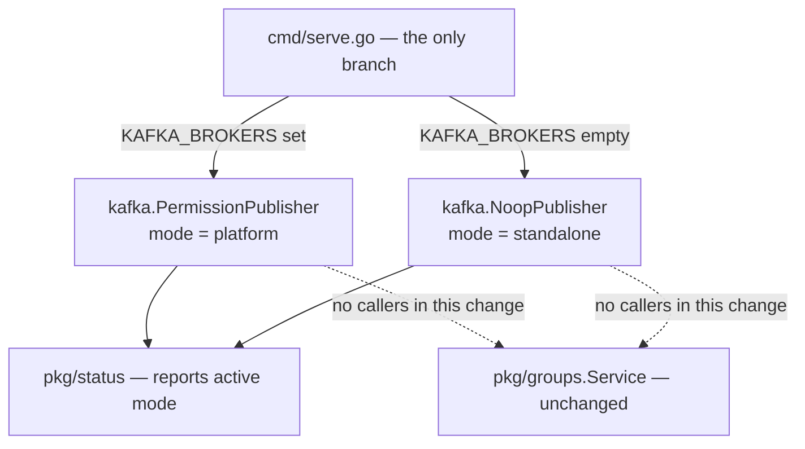

# Design: Platform deployment mode

## 1. Problem shape

hook-service must support two deployments from one codebase:

| | Standalone (Identity Platform) | Portal |
|---|---|---|
| Admin authorization | Role membership, evaluated by Authorization Service from `rules.yaml` | Per-group, model not yet defined |
| Permission events | None | Published, once the model exists |
| Federated identity | `hook-service` | `portal` |
| Database | Own instance | Own instance |
| Group management API | Identical | Identical |

The difference is entirely additive and entirely emissive. The Portal deployment performs every action the standalone deployment performs, plus it publishes permission events. It changes no read, no validation, no response, and no stored data.

```
Portal     = Standalone + { publish permission events }
Standalone = Portal with publishing discarded
```

Because the delta is a strict, side-effect-only superset, a single code path with a discarding sink reproduces both deployments exactly. This is the decision from which the rest follows.

This change publishes nothing. It settles the two questions that do not depend on Portal's authorization model: how a deployment is told which identity and destination to use, and how an operator determines the mode of a running instance. See §5 for why that is worth doing separately.

## 2. Decision: select at startup from configuration, not at compile time

A previously proposed design selected the deployment at compile time, using positive build tags `standalone` and `portal` with two adapter implementations in a new `internal/policy/` package. It is rejected.

### Rejected: build tags

With `//go:build standalone` and `//go:build portal` on files that each define `NewAuthzAdapter`, and an untagged caller in `cmd/serve.go`:

| Invocation | Result |
|---|---|
| `go build ./...` | undefined symbol |
| `go vet ./...` | undefined symbol |
| `go build -tags standalone` | succeeds |
| `go build -tags portal` | succeeds |
| `go build -tags "standalone portal"` | symbol redeclared |

There is no valid default build. The project requires static analysis to pass unconditionally, so every tool invocation — vet, `golangci-lint`, `go generate`, gopls, CodeQL — would need tags threaded through it or would analyze nothing. Restoring a default build requires making standalone untagged and portal negated, which is the negated form that the rejected design itself argued against on the grounds that it defines standalone merely as the absence of portal.

Secondary costs: two binaries, two rocks, two OCI publication streams, two vulnerability surfaces; a coverage baseline that cannot be computed across mutually exclusive files, conflicting with the project's guard against any package regressing more than five percent; and no way to determine at runtime which variant an instance is.

### Rejected: adapter interface selected at runtime

Keeping the rejected design's group authorization adapter interface but choosing the implementation at startup was also considered. It is rejected because the emissive-only delta means there is exactly one behavior to implement, and the project prohibits declaring an interface before two concrete implementations exist. The discarding sink already provides the polymorphism one layer lower, at `PermissionPublisherInterface`, which legitimately has two implementations.

### Accepted



The branch already exists at `cmd/serve.go:183-200`. It gains derived configuration, mode naming, and reporting; its structure is unchanged. The superseded design's stated goal of keeping deployment branching out of domain logic is met, and met more cheaply than by relocating the branch into the linker.

## 3. Decision: one configuration value, two derivations

A Portal deployment needs a distinct destination and must declare a distinct identity in each event. Exposing two independent values permits combinations that disagree, which fail asynchronously inside Authorization Service rather than at startup. A single value removes that class of error.

```
FEDERATED_SERVICE_NAME  (default "hook-service")
  ├─ declared identity (envelope service field) = <name>
  └─ destination topic                          = <name>.permissions
```

| Value | Declared identity | Destination |
|---|---|---|
| `hook-service` | `hook-service` | `hook-service.permissions` |
| `portal` | `portal` | `portal.permissions` |

The default reproduces both current constants exactly (`internal/kafka/producer.go:29,31`), so a standalone deployment's configuration and wire format are unchanged.

Naming. `AUTHZ_SERVICE_NAME` was rejected because it reads as the name of Authorization Service rather than the name of this deployment as known to Authorization Service, which is the opposite of its meaning. `FEDERATED_SERVICE_NAME` matches the vocabulary Authorization Service already uses for its registered clients; its listener is configured with `FEDERATED_SERVICES=hook-service` (`scripts/setup-centralized-authz-e2e.sh:244`). A bare `SERVICE_NAME` was considered and rejected as too generic, since it would compete conceptually with the service identifiers already passed to the metrics and tracing constructors (`cmd/serve.go:66-67`).

Validation runs regardless of the active mode. An invalid name is a configuration error whether or not the running mode consumes it, and restricting the check to platform mode would let a standalone deployment carry a malformed name silently until brokers were first configured, surfacing the fault at a production cutover rather than when the mistake was made. This mirrors `DSN`, which is required irrespective of which code paths read it. Validation covers the character set and the length of the derived destination, so a name that cannot yield a usable destination fails at startup instead of asynchronously at the broker, where automatic topic creation is disabled.

`internal/kafka` holds no deployment-specific default. It previously carried its own copy of the default identity and destination as fallbacks for callers supplying neither, which created two problems: the fallbacks were unreachable once startup validation guaranteed non-empty values, and the duplicated knowledge had to be kept in step with this package's derivation or a default deployment would silently change destination. Worse, had a fallback ever become reachable in a Portal deployment it would have published under the standalone service's identity and destination, which is the precise misattribution this change exists to prevent. Substituting a default is therefore not a safety net but a way of converting a loud failure into a silent one. Both constants are removed, `serviceName` and `topic` are required and used verbatim, and the only default lives in this package as the configuration tag and `DefaultFederatedServiceName`, which are pinned to each other by test.

With the duplication gone there is no cross-package invariant left to guard, so no test is needed to assert one. An empty argument now yields an unusable writer rather than a plausible-looking wrong one; startup validation makes that unreachable, and failing at the point of misuse is preferable to defaulting. Panicking on an empty argument was considered, following the precedent of the OpenFGA client constructor, and rejected as dead defence against a path the startup validator already closes.

The mode is a named type rather than a bare string. It is published as a field of the status contract, so a named type prevents an arbitrary value reaching that contract through the router and status constructors. A named string type marshals to JSON identically, so the wire format is unaffected.

### The destination is carried as publisher state

`PublishOperations` sets a `messaging.destination` trace attribute. It previously read a fixed constant, which is correct only for the default federated service name and misreports every other deployment. The publisher therefore carries its destination alongside its declared identity, and the attribute reads that value.

The destination cannot be recovered from the writer: `KafkaWriterInterface` exposes only `WriteMessages` and `Close`, and `kafkago.Writer.Topic` is a struct field, so no interface method can reach it. Two alternatives were rejected. Wrapping `*kafkago.Writer` in a local type exposing `Destination() string` would make the attribute read the writer's actual topic and so be impossible to contradict, but it changes an exported return type and forces a rework of the type assertion that installs the delivery-completion handler. Re-deriving the destination inside `internal/kafka` from the declared identity would duplicate the derivation rule that this design confines to one function, and would be wrong whenever a caller passes an explicit topic, which the package's own integration test does.

The accepted form passes the derived destination to both the writer and the publisher from the single place that derives it, so disagreement requires deliberate misuse of a package constructor rather than ordinary configuration.

The attribute key is left as `messaging.destination`. The OpenTelemetry messaging conventions have since superseded it with `messaging.destination.name`, and because nothing is published today no consumer can yet depend on either spelling, so renaming it now would be free. It is nonetheless a separate observability decision and is not taken here.

### Group object naming is deliberately not derived

An earlier revision derived a group object type as `<name>-group` for use in published events. With no event published there is nothing to name, so the derivation would be a configured value with no reader. It is omitted. The same reasoning excludes the federated object helpers that would have been added to `internal/authorization/util.go`.

When publishing is introduced, note that `internal/authorization/util.go:21-25` base64-encodes group identifiers because the local OpenFGA model addresses groups by name, which may contain characters invalid in an object identifier. Published events would address groups by their generated UUID primary key, which requires no encoding, so a separate helper is needed rather than a reuse of `GroupTuple`.

## 4. Decision: mode vocabulary and its independence from the name

The two modes are named `platform` and `standalone`, matching the vocabulary used in review of the superseded design.

The mode is derived from broker presence. The federated service name is configured separately. The two can therefore disagree:

```
 name=hook-service   brokers set     → platform mode     (disagree)
 name=portal         brokers unset   → standalone mode   (disagree)
 name=portal         brokers set     → platform mode     (agree)
 name=hook-service   brokers unset   → standalone mode   (agree)
```

Neither disagreement is rejected. Broker presence is the only signal that determines behavior, and a fail-fast second signal was declined: absence of a broker is a legitimate standalone production state and cannot be treated as an error. Both disagreements are warned at startup so they are observable rather than silent.

Alternative rejected: deriving the mode from the federated service name. That would make the name the fail-fast signal that was declined, and it would change behavior for existing standalone deployments, which set neither value.

## 5. Decision: publish nothing in this change

An earlier revision published one illustrative fact on group creation, stating that the creating user may delete the created group. That is removed. The publisher keeps no callers, unchanged from today, and `pkg/groups` is untouched.

The consequence is that this change is preparatory. Its value is threefold, and none of it depends on Portal's model:

1. It replaces the build-tag design as the recorded decision. Until that is done, the build-tag approach remains the standing plan and may be implemented by someone encountering it in isolation.
2. It establishes the mode vocabulary and makes the active mode observable, which is otherwise indeterminable because the code path is identical in both modes.
3. It removes the hardcoded identity from the publisher, so introducing publishing later does not also require reworking configuration.

The cost of deferring is that the configured destination and identity are not exercised by any published event until publishing is introduced. They are covered by unit tests at the construction boundary.

Alternative rejected: deferring this change entirely until Portal's model is known. That leaves the build-tag design as the design of record for an unbounded period, which is the specific outcome this change exists to prevent.

## 6. Database

No schema changes. No migration. No change to stored data.

Recording the creator as a group owner was considered in an earlier revision and rejected. `group_members.role` and `types.RoleOwner` already exist but are never written. Writing them would leave standalone with rows whose creators carry a role value that earlier rows do not, producing a silent inconsistency requiring a backfill if standalone ever surfaces ownership. With publishing removed from scope there is no remaining reason to write them.

## 7. Accepted risks

**A platform deployment without brokers runs as standalone.** Absence of a broker is a legitimate standalone production state, so it cannot be treated as an error. A Portal deployment lacking broker configuration therefore appears healthy while being in the wrong mode. Mitigations: the active mode is reported at startup and on the status endpoint (§8), and the disagreement between a non-default name and standalone mode is warned (§4). The exposure is bounded in this change because nothing is published in either mode; it becomes material only when publishing is introduced.

## 8. Deferred concerns

These do not apply while nothing is published. They are recorded here so that the change introducing publishing inherits them rather than rediscovering them.

**Delivery is fire-and-forget.** `RequiredAcks: RequireNone` with `Async: true` (`internal/kafka/producer.go:56`) means a publish call returns without waiting on the broker and reports almost no real failure. Errors surface only through the asynchronous completion callback (`producer.go:76-80`). A lost event is unrecoverable unless the fact it states is also persisted locally. Acknowledged delivery was considered during the original onboarding and not adopted; the divergence is deliberate and should be revisited when events carry access-granting facts.

**Publishing would occur inside the request transaction.** `db.TransactionMiddleware` (`pkg/web/router.go:59-61`) commits only when the handler returns a status below 400. An event dispatched before a subsequent rollback cannot be withdrawn. The resulting event would name a group UUID that does not exist and never will, because identifiers are generated per row and never reused, so it would grant access to an object that resolves to a 404. That is accumulation of inert data rather than an access-control defect, but it should be a conscious choice rather than an accident.

**Removing events on group deletion is not currently expressible.** The envelope schema (`proto/authorization/service/api/v1/messages.proto:23-28`) requires a concrete subject per operation, and `PermissionOp` offers only write and delete. There is no object-scoped removal, so events naming a deleted group cannot be cleaned up in one operation. The remedy is a schema change in the Authorization Service repository.

**The unbounded batch queue in `segmentio/kafka-go`**, recorded in the `authorization-service-kafka-permission-pipeline` spec, remains dormant while there are no callers.

## 9. Observability

Startup currently logs broker presence (`cmd/serve.go:196,199`). That is replaced by explicit mode reporting: platform mode logs the federated service name, the derived destination, and the brokers; standalone mode logs that publishing is disabled. Because the code path is identical in both modes, these messages and the status endpoint are the only means of distinguishing a running instance, which makes them part of the operational contract.

The status field is sourced from the publisher selected at startup rather than read from the environment when the endpoint is served, so it cannot drift from what was actually wired. The selection of the publisher and the derivation of the mode happen in one function, `newPublisherSetup`, which returns both together; a unit test asserts the pairing directly, so reporting one while wiring the other fails in test rather than in production. Exposing the mode recovers the one genuine advantage of the rejected build-tag design, unambiguous variant identity, at negligible cost.

Publisher tracing and the Kafka dependency-availability gauge are unchanged and remain dormant.

## 10. Security

No change to authentication or authorization enforcement. Authorization decisions continue to be made by Authorization Service from its own rules and model. No new network egress in standalone mode, since no broker is configured. In platform mode the publisher connects to the configured brokers at startup but sends nothing, as it has no callers. Broker connections remain PLAINTEXT with no SASL or TLS configuration, unchanged from current behavior.

## 11. Performance and scalability

No measurable change in either mode. No additional database queries, no additional work on any request path. `pkg/groups` is untouched.

## 12. Migration and rollout

No migration. Standalone deployments require no configuration change: the default federated service name reproduces the existing destination and declared identity, and the absence of broker configuration preserves current behavior.

`scripts/setup-centralized-authz-e2e.sh:254` starts the standalone harness with `KAFKA_BROKERS=localhost:9092`. Under the mode vocabulary introduced here that harness reports platform mode while asserting standalone role-membership behavior, which is misleading. It publishes nothing, so this is a defect in the harness's self-description rather than in its assertions. The broker configuration should be removed. A platform-mode harness is not viable until Portal's model exists in the Authorization Service repository.

The rejected build-tag design must stop being the recorded plan, per §5. Whatever form it currently takes in the repository should be removed or redirected to this change as part of implementation.
