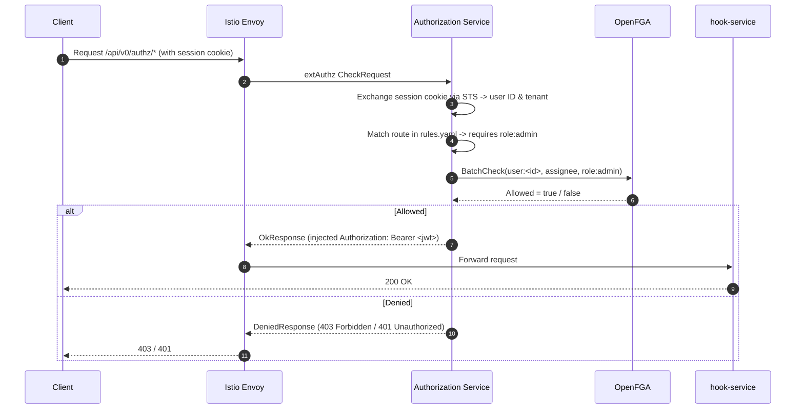

# Context

The hook-service manages user groups and group memberships that enrich OAuth tokens during token issuance:
1. **Admin API endpoints** (`/api/v0/authz/*`): Provide CRUD and membership management for groups. Currently protected only by local JWT authentication middleware with no centralized authorization checks.
2. **Token hook endpoint** (`/api/v0/hook/hydra`): Enriches tokens with group claims using its dedicated OpenFGA client and private store.
3. **App-to-group endpoints** (`/api/v0/authz/groups/{id}/apps`): Manage app authorization mappings using direct OpenFGA write methods.

The Authorization Service (`canonical/authorization-service`) provides centralized authorization via Istio external authorization (`extAuthz`), evaluating route-based policies against a shared OpenFGA store.

This design onboards hook-service's admin API to Authorization Service using a coarse-grained Role-Based Access Control (RBAC) model. All administrative endpoints are guarded by membership in the `role:admin` role. No dynamic per-group permission tuples are published to OpenFGA at runtime, while Kafka producer infrastructure is maintained in standby mode for future event-driven authorization needs.

### Authorization Model & Rules Mapping

The Authorization Service core model defines the `role` type in `authz/model/core/core.fga`:

```openfga
type role
  relations
    define assignee: [user with tenant_match]
    define owner: [user with tenant_match]
```

Because the authorization model relies entirely on the core `role:admin` definition, no custom `.fga` types or module definitions are required.

Route protection rules in `authz/model/services/hook-service/rules.yaml` map all admin API endpoints to the `role:admin` assignee check:

```yaml
rules:
  - method: GET
    match: '/api/v0/authz/groups'
    tuples:
      - permission: assignee
        object_resource_type: role
        object_resource_id: 'admin'
  - method: POST
    match: '/api/v0/authz/groups'
    tuples:
      - permission: assignee
        object_resource_type: role
        object_resource_id: 'admin'
  - method: GET
    match: '/api/v0/authz/groups/{groupId}'
    tuples:
      - permission: assignee
        object_resource_type: role
        object_resource_id: 'admin'
  - method: PUT
    match: '/api/v0/authz/groups/{groupId}'
    tuples:
      - permission: assignee
        object_resource_type: role
        object_resource_id: 'admin'
  - method: DELETE
    match: '/api/v0/authz/groups/{groupId}'
    tuples:
      - permission: assignee
        object_resource_type: role
        object_resource_id: 'admin'
  - method: GET
    match: '/api/v0/authz/groups/{groupId}/users'
    tuples:
      - permission: assignee
        object_resource_type: role
        object_resource_id: 'admin'
  - method: POST
    match: '/api/v0/authz/groups/{groupId}/users'
    tuples:
      - permission: assignee
        object_resource_type: role
        object_resource_id: 'admin'
  - method: DELETE
    match: '/api/v0/authz/groups/{groupId}/users/**'
    tuples:
      - permission: assignee
        object_resource_type: role
        object_resource_id: 'admin'
  - method: GET
    match: '/api/v0/authz/users/{userId}/groups'
    tuples:
      - permission: assignee
        object_resource_type: role
        object_resource_id: 'admin'
  - method: POST
    match: '/api/v0/authz/users/{userId}/groups'
    tuples:
      - permission: assignee
        object_resource_type: role
        object_resource_id: 'admin'
```

### Seeding

Initial administrative access is bootstrapped via a one-time seed in the Authorization Service shared OpenFGA store:

| Subject | Relation | Object | Condition |
|---------|----------|--------|-----------|
| `user:<admin_id>` | `assignee` | `role:admin` | `tenant_match` |

### Runtime Request Evaluation Flow



### Kafka Architecture (Dormant Standby Pipeline)

The Kafka producer infrastructure (`internal/kafka/`) is maintained in standby mode:
- Producer implementation (`PermissionPublisher`) and configuration (`KAFKA_BROKERS`) are wired at startup.
- Configured with `segmentio/kafka-go` in asynchronous mode (`Async: true`), `RequiredAcks: RequireNone`, and `MaxAttempts: 10`, providing true fire-and-forget non-blocking publication with resilient retries for transient broker errors without waiting for broker disk or replica acknowledgment.
- Bounded network timeouts: `ReadTimeout: 1 * time.Second` prevents slow topic metadata resolution from blocking the caller, and `WriteTimeout: 2 * time.Second` bounds background produce requests.
- A background `Completion` callback tracks asynchronous delivery results, solely logging any errors if delivery fails in the background.
- In this coarse-grained model, group lifecycle operations (`CreateGroup`, `UpdateGroup`, `DeleteGroup`, `AddUsersToGroup`, `RemoveUsersFromGroup`) execute directly against PostgreSQL without emitting Kafka events.
- Maintaining the producer package and wiring ensures zero regression for architectural readiness, enabling fast activation should fine-grained event publishing be needed in the future.

## Goals / Non-Goals

**Goals:**
- Protect hook-service admin API endpoints with centralized RBAC via Authorization Service extAuthz.
- Eliminate runtime Kafka event publishing overhead during group operations.
- Maintain standby Kafka producer infrastructure in `internal/kafka/` with non-blocking, asynchronous execution.
- Disable local JWT authentication on admin routes (`AUTHENTICATION_ENABLED=false`).
- Preserve existing token hook and app authorization behaviors.

**Non-Goals:**
- Dynamic per-group permission publishing or per-group ReBAC.
- Migrating the token hook endpoint or its dedicated OpenFGA client/store.
- Migrating app-to-group authorization (`POST /groups/{id}/apps`).

## Decisions

### D1: Coarse-grained RBAC via `role:admin`

**Chosen**: Authorize all admin API endpoints based on membership in `role:admin` (`permission: assignee`, `object_resource_type: role`, `object_resource_id: 'admin'`).

**Rationale**: Hook-service admin APIs are operational endpoints intended for identity platform administrators. Guarding them with `role:admin` provides robust, centralized access control through the existing core role model. It avoids storing millions of ephemeral per-group tuples in OpenFGA and eliminates operational dependencies on Kafka for day-to-day group management.

### D2: Zero runtime Kafka event publishing for group lifecycle

**Chosen**: Do not publish Kafka permission events during group creation, deletion, or membership modification. PostgreSQL remains the sole authority for group and membership state.

**Rationale**: Because authorization decisions are evaluated against `role:admin` at the domain level, OpenFGA does not require per-group tuples. Omitting Kafka event emission prevents distributed transaction complexity, eliminates eventual-consistency sync delays, and removes failure modes where database writes succeed but Kafka delivery fails.

### D3: Maintain standby, non-blocking Kafka producer in `internal/kafka/`

**Chosen**: Keep the Kafka producer package (`internal/kafka/`), configuration, metrics, and startup wiring intact in standby mode, configured with `Async: true`, `RequiredAcks: RequireNone`, `MaxAttempts: 10`, `ReadTimeout=1s`, `WriteTimeout=2s`, and error-only background `Completion` logging (Option A).

**Rationale**: Preserves architectural investment and allows re-enabling event-driven authorization in the future without re-implementing Kafka integration or protobuf definitions. Asynchronous fire-and-forget publishing ensures that publishing operations never block API or database execution paths.

### D4: Disable JWT authentication on admin routes

**Chosen**: Set `AUTHENTICATION_ENABLED=false` to disable local JWT middleware on admin routes. Authorization Service extAuthz handles authentication and authorization at the ingress proxy.

**Rationale**: Avoids redundant JWT verification inside hook-service. Istio extAuthz validates the session cookie via STS and injects a cryptographically verified `Authorization: Bearer <jwt>` header before forwarding the request.

### D5: Exclude token hook, metrics, and health endpoints from extAuthz

**Chosen**: Exclude `/api/v0/hook/hydra`, `/api/v0/metrics`, and `/api/v0/status` from extAuthz enforcement.

**Rationale**: The token hook is invoked by Ory Hydra using internal machine-to-machine tokens validated by `API_TOKEN` middleware. Metrics and status endpoints are polled by Prometheus and Kubernetes probes without user session credentials.

### D6: Caller identity extracted strictly from forwarded Authorization Bearer token

**Chosen**: Extract caller identity exclusively from the `Authorization: Bearer <jwt>` header injected by Istio/Envoy after successful STS exchange. Never trust caller-supplied identity headers.

**Rationale**: Prevents header-spoofing and identity impersonation attacks.

## Risks / Trade-offs

| Risk / Trade-off | Mitigation |
|------------------|------------|
| All-or-nothing admin access (no read-only viewer role) | All admin endpoints are restricted to platform administrators with `role:admin`. If read-only auditor roles are needed in the future, `rules.yaml` can be updated. |
| Role name coupling (`role:admin`) | Standardized on `role:admin` across platform services. The role is managed centrally in Authorization Service. |
| Inactive Kafka producer connection | When `KAFKA_BROKERS` is unset or empty, the producer initializes as a no-op / nil publisher, avoiding unnecessary network connections. |
| **Unbounded memory growth during extended Kafka outage (Option A)** | In `segmentio/kafka-go`, the internal queue (`batchQueue.Put`) uses an unbounded slice (`append`). If Kafka experiences an extended outage while writes occur, memory usage will grow without backpressure. **Mitigations:** (1) In standby mode, group operations emit 0 events; (2) bounded `ReadTimeout` (1s) and `WriteTimeout` (2s) prevent thread starvation; (3) Prometheus dependency availability metrics alert on delivery failures; (4) if fine-grained event publishing is activated in the future under high write traffic, the publisher can be upgraded to an application-level bounded channel buffer with drop/dead-letter policies (Option B). |